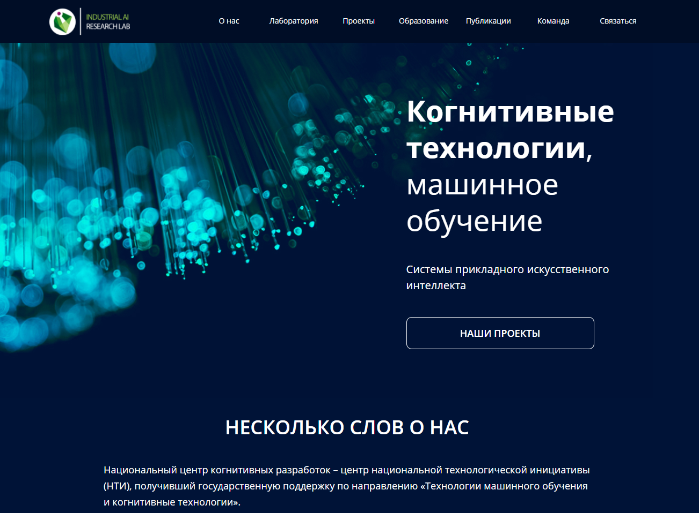

# Проект: ITMO
Идея проекта - создать коллективный проект в рамках курса - Yandex.Practicum. 

**Используемые технологии**
* Flexbox
* Grid
* Медиазапросы
* БЭМ
* JS
* etc

**Ссылка на GitHub Pages**

[steanull.github.io/industrial-itmo/](https://steanull.github.io/industrial-itmo/)

**Над проектом работали:**
* Александр Савосько [github.com/steanull](https://github.com/steanull)
* Станислав Судовский [github.com/grecha1337](https://github.com/grecha1337)
* Владислав Белявский [github.com/live-outside](https://github.com/live-outside)
